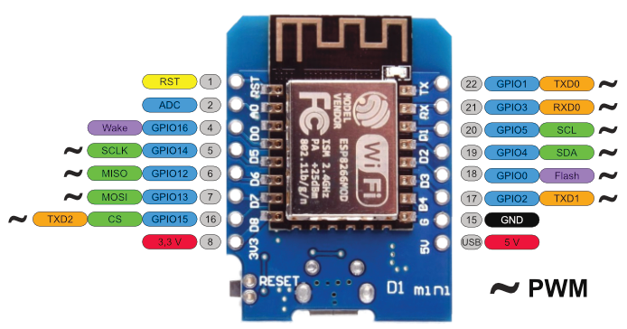

# ⚠️ Work in progress ⚠️

This is a MicroPython application that provides an HTTP API to control GPIO ports remotely.

## Requirements

- **WeMos D1 Mini board:** the application works with other esp8266 boards but, the pins are currently labeled for this one:



- **Python 3.9.*:** It has to be 3.9.* specifically for compatibility with MicroPython
- **[Poetry](https://python-poetry.org/docs/#installation):** Dependency management tool
- **C compiler:** Install the necessary tools by running `sudo apt install build-essential` in Ubuntu/Debian based systems, or `xcode-select --install` in MacOS
- **[Pyenv](https://github.com/pyenv/pyenv#simple-python-version-management-pyenv):** Optional, used to manage multiple Python versions and environments
- **cURL:** The ubiquitous command line tool for making HTTP requests

## Usage

### Quickstart

Connect the esp board and find the serial device associated to it, the project expects it to be `/dev/ttyUSB0`, but if it's not you can always specify the correct one with the `ESP_DEVICE` environment variable.

```bash
# Optional: specify the esp board device
export ESP_DEVICE=/dev/...

# Validate Python version is 3.9.*
python -V

# Optional: If you're using pyenv install Python 3.9.12, it
# should be activated automatically thanks to the .python-version file
pyenv install 3.9.12

# Add your user to the dialout group so it can interact with the board
# using the serial device, otherwise run everything as root (sudo)
sudo adduser $USERNAME dialout
newgrp dialout

# Flash MicroPython into the esp board, only ever needed once unless
# you disable the Python interpreter in UART0 and get locked out
make flash-board

# TODO *********************************************************************************************
# Configure WiFi, this just generates the config/wifi.secret.json file
make setup-wifi

# Bundle the application, push it to the esp boar and reset the board
make push restart

# TODO *********************************************************************************************
# Get the IP address of the board, you might need to run this several times
# while the board gets an IP
make show-ip

## Test

# Get onboard led status
curl "http://$ESP_BOARD_IP/gpio/led/"

# Turn on the onboard led
curl -H "Content-Type: application/json" -X POST '{"script": "on"}' "http://$ESP_BOARD_IP/gpio/led/"
```

### HTTP API spec

```json
{
  "repeat": <NUMBER OF TIMES>,
  "script": <COMMAND> | [<COMMAND>, ...]
}
```

## Development

### Tooling

```bash
# See available commands
make

# Open rshell, useful to check the board's filesystem under /pyboard
make rshell

# Open a Python interpreter in the esp board, useful for debugging/troubleshooting
make repl

# Push code changes to the board without a restart, it uses rshell's rsync
# to modify only the files that need an update
make push

# Attach to the Python interpreter and start the application, useful to see logs
make attach

# Run this after making changes to deploy, run, and see the logs, useful for debugging
make push reset attach
```

### Project structure

The project has a very simple structure:

- **`config/`**: This directory contains the application configuration in json files; it's copied as-is into the root directory of the board
- **`skel/`**: Scaffold, these files are used to launch the application automatically when the board boots and to setup low level base board configuration; the contents of this directory are copied as is into the root directory of the board
- **`lib/`**: Python standard library modules that aren't included by default in MicroPython; the contents of this directory copied into `/lib` in the board with rsync
- **`src/`**: Application source code; the contents of this directory copied into `/app` in the board with rsync
  - **`src/vendor`**: Third party libraries used in this project

## Notes

- Source code files under `src` and `lib` are cross-compiled using `mpy-cross`, this is important because the board runs out of memory when compiling some of the modules itself, for example [microdot](https://github.com/miguelgrinberg/microdot)
- The `mpy-cross` version has to match the MicroPython firmware version, so the tool has to be compiled from a tag instead of the master branch
- Adding a user to a group with `adduser` doesn't automatically updates the group membership status in the current session; you'll have to use [newgrp](https://linux.die.net/man/1/newgrp), or log out and log in, so that the group becomes effective.
- If you disable [UART0](https://docs.micropython.org/en/latest/esp8266/quickref.html#uart-serial-bus) you won't be able to connect to the board with the USB interface, you'll have to flash the firmware again do to so
- Python standard library [ports](https://github.com/micropython/micropython-lib/tree/master/python-stdlib) not included in MicroPython by default
- Tips on how to work around memory [constrains](http://hinch.me.uk/html/reference/constrained.html)
- Additional [resources](https://github.com/peterhinch/micropython-samples/blob/master/README.md)
